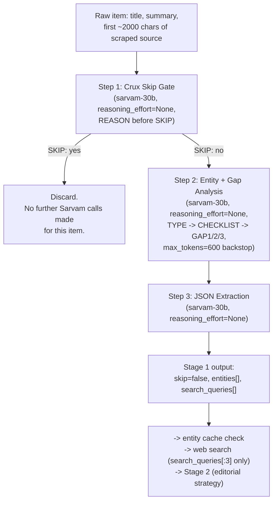

# Prompt Design Thought Process

This document is the full history of how Stage 1 of the TechDrishti pipeline reached its
current design — every problem found, every fix tried, what broke, what worked, and how each
claim was actually verified against the live Sarvam API rather than assumed. It covers Stage 1
completely: the skip decision, entity extraction, and query/gap generation.

The organizing idea throughout: **don't trust a prompt because it reads well — test it against
real content, multiple times, and let the actual output decide.** Several fixes that looked
obviously correct on paper turned out to be wrong, or only half-right, once tested.

---

## Part 1 — Why Stage 1 needed to change at all

### The original design

Stage 1's job: read a collected article and decide (a) is this genuine tech news or should it
be discarded, and (b) if kept, what entities does it mention and what should be searched to add
context. Originally this was **one single call** to `sarvam-30b` asking for both things at once,
returned as JSON: `{"skip": bool, "entities": [...], "search_queries": [...]}`.

### The problem

This call would intermittently return **nothing at all**. The mechanism: Sarvam's reasoning
models "think" before writing an answer, and that thinking consumes tokens from the *same*
budget as the final output (`max_tokens: 4096`, a hard cap confirmed via the API's own error
message on this subscription tier). If the model's reasoning ran long, there was nothing left
to write the actual JSON — the API returns `content: None` in that case, with the reasoning
dumped into a separate `reasoning_content` field instead.

**Proof, not assumption**: the exact same prompt, run 3 times on the same real article, produced
3 different outcomes — once genuine entities came through, once the response was completely
empty, once it returned literal unfilled template placeholders (`<EntityName>`) that had leaked
out of the model's own reasoning about the JSON schema it was supposed to fill in. Same input,
same code, three different results — a coin flip, not a bug with a single fixable line.

### Attempt 1 — two-call split (reason freely, then extract)

Mirroring the same "plan then execute" idea already used for Stage 2 → Stage 3: split into
**Call A** (free-text analysis, no rigid format, reasoning left on) and **Call B** (transcribe
Call A's analysis into strict JSON, `reasoning_effort=None`).

Why this helps: Call A doesn't need a strict format, so it can't run out of room to answer —
whatever it produces (via `content` or the `reasoning_content` fallback) usually contains the
needed information. Call B never has to think, so it always has the full budget free to write.

**Result**: real improvement, but not everything was fixed — the skip judgment itself was still
inconsistent on borderline cases (tested directly: the same ambiguous "is this a job posting"
case got 3 different outcomes across 3 runs, unrelated to which architecture was used). This
motivated separating the skip decision into its own dedicated step, since it's a genuinely
different kind of judgment than entity extraction.

---

## Part 2 — The skip decision: isolating it and getting it right

### Attempt 2 — `reasoning_effort="low"`, verdict written before the reason

First 3-step design tried: a dedicated skip-gate call (`reasoning_effort="low"`), then entity
analysis, then JSON extraction. Format asked for `SKIP: yes/no` first, then `REASON:`.

**First test** (a real news article + a real job-posting repo, 3 runs each): 6/6 correct
decisions — genuinely good. But 2 of those 6 runs showed something wasteful: the model spiraled
into extremely long, repetitive internal monologue — arguing with itself for thousands of words
about what its own answer should be — before eventually landing on the right verdict via the
`reasoning_content` fallback.

### Digging into why, and a wrong turn

Hypothesis: the model was confused about the *polarity* of `SKIP: yes/no` — unsure whether "no"
meant "don't skip" or something else. Fix tried: spell out explicitly what each answer means
(*"SKIP: yes means discard, SKIP: no means keep"*).

**Retested on a different real pair** (a genuine GPU-hardware story, an internship-tracker repo,
3 runs each): the clear-cut case (GPU story) went from occasionally-rambling to **3/3 clean,
fast, correct** — the polarity fix genuinely worked there. But the ambiguous case (internship
repo) got *worse*: one clean run, one correct-but-wasteful run, and **one outright failure** —
the model rambled through the entire token budget arguing about whether a repo counts as "a
directory with no news event," and never produced a parseable answer at all.

**Lesson learned by testing, not assuming**: the polarity fix solved a *format* confusion. It
did nothing for a case where the model was genuinely, substantively uncertain — no amount of
wording clarity stops a model from re-litigating a hard call. And because `reasoning_effort="low"`
doesn't cap how long that re-litigation can run, one bad case could consume the whole budget
and produce nothing.

### Testing whether a smaller token budget would help — it made things worse

Direct test: same prompt, `reasoning_effort="low"`, three budgets (150/250/400 tokens), 3 runs
each on both a real GPU-hardware article and the job-posting repo. **Result: 0 of 12 runs ever
finished naturally.** Every single one hit `finish_reason: length` — the model always opened
with "Let me analyze this article..." and got cut off mid-thought, regardless of budget size up
to 400 tokens. A tight cap didn't produce cheap failures only on hard cases — it produced
failure on *every* case, because this model reliably needs well over 400 tokens of preamble
once reasoning is enabled at all. **Conclusion: token-budget tuning was a dead end.**

### The actual fix — `reasoning_effort=None`, but reason written before the verdict

Tested `reasoning_effort=None` with the verdict field first (`SKIP:` before `REASON:`): fast,
always finished (`finish_reason: stop`), but **wrong 5/5 times** on the GPU article specifically
— it kept answering `SKIP: yes` (discard) while its own stated reason said *"a notable hardware
release in the AI/ML/CV/NLP/LLM space"*, which is exactly a keep-criterion. The reason and the
verdict disagreed with each other.

**Why**: with reasoning off, there's no hidden thinking phase — the model writes strictly in
the order requested. Asking for the verdict first meant it had to commit to an answer *before*
it had written any reasoning to base it on; the "reason" that followed was written to justify
whatever it had already committed to, not the thing that produced the verdict.

**Fix**: swap the order — `REASON:` first, `SKIP:` second. Nothing else changed (same model,
same `reasoning_effort=None`, same ~250 token budget). **Result: 10 of 10 correct** across both
cases, 5 runs each, every run finishing naturally and well under budget. This was the actual
fix — not the token budget, not the polarity wording, but making the output format itself force
reasoning to exist before the decision that depends on it.

### Verified directly against the raw API response, not inferred

Same exact prompt, only `reasoning_effort` changed:

```
reasoning_effort=None:
  content:            "REASON: ...a notable hardware release...\nSKIP: no"
  reasoning_content:   None
  finish_reason:       stop

reasoning_effort unset (default, reasoning on):
  content:             None
  reasoning_content:   "I need to respond in exactly the format requested...
                        So my REASON should be... For SKIP, I need to determine... [cut off]"
  finish_reason:       length
```

With reasoning off, the full answer — including the reasoning — is written directly into
`content`; there's no separate hidden channel, the `REASON:` line *is* the reasoning, done in
the open. With reasoning on, all the thinking happens in a completely separate field, and in
this specific capture the model worked through almost the entire correct answer inside that
hidden field, then ran out of budget before ever writing anything to `content` — an empty
response despite having essentially solved the problem internally. This is direct proof of the
exact mechanism causing every "returns nothing" failure documented in this project.

**Production prompt** (`_STAGE1_SKIP_PROMPT` in `writer/synthesize.py`):
```
Research assistant for टेकदृष्टि (TechDrishti), a Hindi tech publication.
Decide if the article below is genuine tech news suitable for publication, or should be skipped.

Title: {title}
Summary: {summary}
Source: {source_text}

Skip ONLY if this is:
- A job/career posting (even if about the tech sector)
- A product marketplace, directory, or "Show HN" website showcase with no news event
- A personal blog, tutorial, or documentation page — not a news article
- Content with no identifiable tech news event (announcement, launch, acquisition, regulation, research)
Do NOT skip articles ABOUT job market trends, hiring booms/crises, or industry-level employment analysis — those are real news.

Respond in EXACTLY this format, with no other text before or after — REASON comes first,
decide your verdict only after stating the reason:
REASON: <one sentence stating what the core crux of this article is>
SKIP: yes or no

"SKIP: yes" means discard this article. "SKIP: no" means keep it, it is genuine news.
```
`reasoning_effort=None`, `sarvam-30b`.

---

## Part 3 — Entity + query analysis: the second half of Stage 1

### An assumption that turned out to be wrong

The entity/query analysis step (asking for `ENTITIES:` and `QUERIES:`) was initially left with
`reasoning_effort` unset ("it isn't broken, no need to touch it"). This assumption was never
tested directly — it was carried over from the earlier two-call design without re-verification.

**Testing it anyway** (3 runs, real article) revealed the *exact same* failure pattern found and
fixed everywhere else: every run hit `content=None, reasoning_content fallback`, with the model
repeating an identical block of self-correction — *"Actually, I'm overthinking this... Let me
just provide exactly 1-3 queries..."* — 15+ times in one run. One run never finished at all,
cut off mid-word. It only ever produced usable output because a downstream step happened to be
robust enough to salvage a result from the noise — the same coin-flip reliability problem,
just not yet caught here because it hadn't been tested.

**Fix**: `reasoning_effort=None`, same pattern as the skip gate. **Result**: 3/3 clean, fast,
well under 350 characters, no rambling — and the actual entities/queries extracted were
comparable in quality to what the reasoning-on version eventually produced when it succeeded.
**Lesson reinforced**: "it hasn't broken yet" is not the same as "it's been tested."

### The chicken-and-egg problem with query generation

The original instruction ("generate 1-3 comparison/why-now search queries") had a real
conceptual gap: a good query should fill in what the finished *narrative* will need — but the
narrative doesn't exist yet at this stage; it's what Stage 2 builds *later*. Asking the model to
imagine the finished analysis before writing it is circular.

**The resolution**: the model doesn't need to know the finished narrative — it only needs a
small, fixed checklist of things a good analysis piece on *this kind of story* typically needs
(competitive comparison, pricing, why-now, market reception), and can check each checklist item
against what the article *already states*. That's a bounded, answerable task ("is X mentioned or
not?"), not a circular one ("what will the narrative need?"). If everything on the checklist is
already covered, the correct answer is zero queries, not a forced 1-3.

### First structured attempt — open list, repetition disaster

Prompt redesigned as: classify story `TYPE` (model_release / acquisition / ban_regulation /
repo_analysis / general) → apply a type-specific checklist → check each item against the
article → emit up to 3 queries for genuine gaps only, as an open `GAPS:` list.

**Tested on a real GPU-hardware article, 3 runs**: run 1 worked exactly as intended (4 sensible,
specific gaps). **Runs 2 and 3 spiraled into runaway repetition** — hundreds of near-identical
lines (*"What are the specific technical challenges in meeting the X requirements?"*, with X
cycling through market, governance, oversight, compliance...) until hitting the full 4096-token
budget. This is a *different* failure mode than the reasoning-starvation one — it happened
directly in the visible answer, not a hidden channel, and `reasoning_effort=None` did nothing to
prevent it. It's a known degenerate-repetition pattern in smaller models: once a formulaic
pattern starts, local context predicts "continue the pattern" more strongly than the instruction
to stop.

### Fix — numbered slots, and an explicit cap-not-minimum instruction

Two changes: (1) replace the open `GAPS:` list with fixed slots `GAP1:`/`GAP2:`/`GAP3:`, each
independently `"none"` or a query — no open-ended list to keep extending; (2) explicit
instruction that these are a **maximum, not a target** — *"it is normal and expected for some or
all slots to be none, do not invent a question just to fill a slot."*

**Tested on the same article, 3 runs**: 3/3 clean, correctly typed, exactly 3 well-targeted gaps
each time (competitor benchmarks, architectural details, pricing) — no repetition at all.

### Model choice — a genuinely counter-intuitive result

Tested the same structured prompt on both `sarvam-30b` and `sarvam-105b`, 3 runs each, same
article. **`sarvam-30b`: 3/3 clean.** **`sarvam-105b`: worse** — one clean run, one run that
ignored the 3-slot limit and kept going to `GAP10`, and one run that produced **190+ numbered
slots**, spiraling into completely unrelated domains (*"applications of Zeus GPU in psychology,"
"in dreams," "in social justice," "in cardiology"*...) for an 18,749-character response — the
same repetition bug, worse, on the supposedly higher-quality model. **The bigger, more expensive
model did not respect the numbered-slot structure any better than the smaller one did.**
Assessed independently: `sarvam-30b`'s reasoning across all runs was consistently grounded in
what the specific article actually said; `sarvam-105b`'s reasoning degraded into generic
padding once it exceeded 3 items, and became fully incoherent in the worst case. **Decision:
use `sarvam-30b`, not `sarvam-105b`, for this task** — cheaper and more reliable here, a direct
counter to the assumption that the larger model would be the safer choice.

### Broader validation — 4 diverse real news cases, not just one

To avoid over-fitting the fix to a single test article, the numbered-slot design was tested
against 4 different, real, current stories, 3 runs each (12 runs total):

| Case | Type correctly identified | Result |
|---|---|---|
| Persistent Systems acquiring Nagarro (real deal, ~€1.27bn) | `acquisition` | 3/3 clean, sharp gaps (portfolio fit, integration risk, competitive positioning) — even though the scraper returned 0 characters and the model was working from title+summary alone |
| Japan-India tech investment (₹1 lakh crore, AI/semiconductors) | `general` (correctly didn't force it into another category) | 2/3 clean; 1 run duplicated its own answer block once (minor glitch, not runaway) |
| Mistral's Leanstral 1.5 (Lean 4 theorem-proving model) | `model_release` | 1/3 clean, 1/3 minor extra glitch, **1/3 the catastrophic repetition bug recurred** (ran to `GAP96` before cutoff) — the densest, most benchmark-heavy article of the four |
| SearXNG (GitHub repo) | `repo_analysis` | 3/3 clean |

**Honest reading of this data**: 10 of 12 runs clean — a real improvement — but the wording fix
*reduced*, did not *eliminate*, the repetition risk, and it recurred specifically on the most
information-dense source material. This means prompt wording alone is not a sufficient
guardrail; a technical backstop is also needed.

**On the specific worry that Leanstral's article doesn't explain what "Lean" even is**: checked
directly — `Lean (language)` and `Lean 4 (framework)` were correctly extracted as entities in
every run. That's actually sufficient, because explaining unfamiliar entities isn't this step's
job — the pipeline already has a separate, automatic mechanism for it: any entity not already in
`data/entity_cache.json` gets its own identity-lookup query built by the existing code
(`'"{name}" {type} overview'`), independent of whatever this gap-analysis step decides. The
checklist explicitly excludes "what is X" identity questions from the gap queries for exactly
this reason — that job already belongs to a different part of the pipeline.

### Final backstop — an actual token cap, not just wording

Given the repetition bug recurred even with the improved prompt, wired in `max_tokens=600` for
this specific call as a hard technical limit (added a `max_tokens` parameter to `_call_sarvam`,
default 4096 unchanged everywhere else). This doesn't stop the model from starting a repetition
loop, but it stops one from silently consuming the entire 4096-token budget — it gets cut off
cheaply instead.

**Verified in the first live end-to-end production run after wiring this in**: the repetition
tendency showed up again (15 queries generated instead of ≤3) — the cap contained it to roughly
15 items instead of 100-300, but did not prevent it from starting. **This is not fully solved**,
and it would be dishonest to claim otherwise. The practical damage is limited, though: the
pipeline's existing downstream code already truncates to `search_queries[:3]` before any of
those queries are actually searched, so the only real cost of an over-generation event is a few
hundred wasted tokens in this one call, not extra downstream API calls or search cost.

---

## Part 4 — Final production design



All three steps live in `writer/synthesize.py`: `_STAGE1_SKIP_PROMPT`, `_STAGE1_ANALYSIS_PROMPT`,
`_STAGE1_EXTRACTION_PROMPT`, orchestrated by `_stage1_extract_queries()`.

## Part 5 — Production follow-up: the source-text truncation bug

This design was validated on 4 diverse test cases and wired into production (Part 4). Running
it against further real, live articles surfaced a fifth failure mode that none of those 4 test
cases happened to expose: **Steps 1 and 2 were only shown `source_text[:800]`**, and on some
articles the actual named entities simply don't appear that early.

### The case that exposed it

A real article about an eye-perfusion device opens with several sentences of generic
scene-setting — "it's not easy to transplant a whole human eye... the surgery is difficult...
the eyes themselves start to degenerate..." — before ever naming the device, the researcher, or
the institution behind it. Checked directly against the scraped text: the device's name
(`Eye-in-a-Care-Box` / `ECaBox`) first appears at character 1223, the institution
(`Barcelona Institute of Science and Technology`) at 1103, the researcher (`Tessier`) at 876 —
all past the 800-character cutoff Steps 1-2 were working with. Step 1/2 had no choice but to
extract what was actually in front of them: generic nouns like `"device"`, `"perfusion"`,
`"researchers"` instead of the real names.

### Why this wasn't caught by the earlier 4-case validation

None of those 4 test articles happened to bury their key names past 800 characters — the
validation was real, but it wasn't testing this specific dimension (how deep into an article
the first named-entity mention sits), so it couldn't have caught this. Worth stating plainly:
a validation set that's diverse in *topic* isn't automatically diverse in every dimension a bug
could hide along.

### Confirming the cause before touching anything

Stage 2 (a separate call, downstream of Stage 1) uses `source_text[:2000]` and reliably found
the real names on this exact article — `Pia Cosma`, `Shannon Tessier`, `Centre for Genomic
Regulation`, `Massachusetts General Hospital`, `Barcelona Institute of Science and Technology`,
`ECaBox` all came through correctly in Stage 2's own `key_facts_and_quotes` field. That
side-by-side comparison (same article, same underlying model family, different truncation
length, different outcome) is what confirmed this was a truncation problem, not a prompt-wording
or judgment problem — the kind of problem Part 2 and Part 3 spent most of their effort on.

### The fix and the verification

Raised Steps 1-2's truncation from `source_text[:800]` to `source_text[:2000]`, matching Stage
2. Reran Stage 1 on the identical article 3 times:

| Run | Entities extracted |
|---|---|
| 1 (before fix) | `device`, `researchers`, `perfusion` — every run |
| 1 (after fix) | `Shannon Tessier`, `Pia Cosma`, `Centre for Genomic Regulation`, `Massachusetts General Hospital`, `Barcelona Institute of Science and Technology`, `pig`, `ECaBox` |
| 2 (after fix) | same real names, plus correct `"ambiguous"` flags on `pig`/`ECaBox` |
| 3 (after fix) | same real names again |

0 of 3 generic-noun extractions after the fix, versus every run before it.

### What this fix did NOT touch — reported honestly, not glossed over

The same 3 runs surfaced two *separate* problems, pre-existing and unrelated to truncation:

- **Query-count variance**: run 1 generated 9 search queries, run 2 generated 3, run 3 generated
  0 — all on the identical input. This is the same run-to-run judgment inconsistency documented
  in Part 3/Part 4's residual issues, not something the truncation fix touches one way or the
  other. Downstream `search_queries[:3]` truncation still bounds the practical cost.
- **Entity-type mistakes**: run 3 typed `Massachusetts General Hospital` as `person` instead of
  `organization`, and flagged nearly every entity `"ambiguous": true` without a coherent reason
  (`resolved_sense` values like `"person"`/`"organization"` that just restate the type field
  rather than disambiguating anything). This is the entity-typing/ambiguity problem already
  named as unsolved in residual issue 3 below — the truncation fix gave Stage 1 the *right
  names* to work with, it didn't make its judgment about those names any more consistent.

## Known, honestly-stated residual issues

1. **The gap-generation repetition bug is reduced, not eliminated.** It recurred once in 12 test
   runs (on the densest article) and once in the first live production run after this design was
   wired in, and again (9 queries instead of ≤3) during the truncation-fix verification above.
   The `max_tokens=600` cap contains the blast radius but doesn't prevent the model from starting
   the loop. Downstream `search_queries[:3]` truncation limits the practical damage to wasted
   generation tokens, not extra search cost.
2. **The skip decision's underlying judgment is still run-to-run inconsistent on genuinely
   ambiguous cases** — the reason-before-verdict fix solved the *format*/token-starvation
   failure modes, not the model occasionally disagreeing with itself on a hard call. This is a
   different, harder problem, and hasn't been solved here.
3. **Entity typing and ambiguity resolution still rely entirely on the LLM.** A hybrid approach
   (a deterministic NLP/POS-based candidate extractor feeding a small LLM call for typing and
   ambiguity only) was discussed as a future option for speed/cost, not yet built or tested.
   Confirmed still relevant by the entity-mistyping and ambiguity-over-flagging seen in Part 5.
4. **Source-text truncation depth (800 -> 2000 chars) — fixed, but the underlying assumption
   (2000 chars is "enough") hasn't itself been stress-tested the way the original 4-case
   validation stress-tested the query-generation design.** A sufficiently long preamble could in
   principle still push key names past 2000 characters; this hasn't been observed live yet, but
   it's the same class of bug as the one Part 5 just fixed, and worth watching for.
