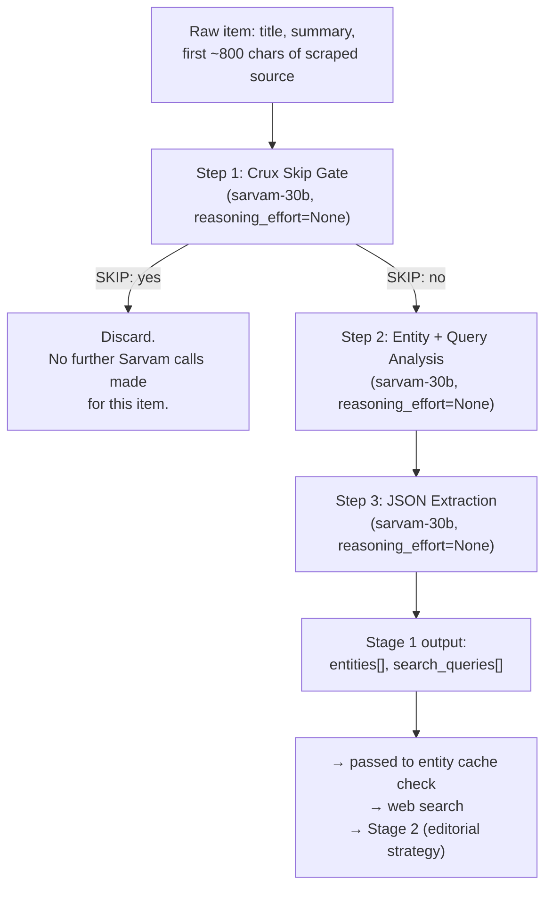

# Stage 1 — Final Validated Design (proposed, not yet wired into production)

This document covers Stage 1 of the TechDrishti pipeline: the step that decides whether a
collected item is worth writing about, and if so, what entities and search queries to research.
Everything below was tested live against the real Sarvam API before being written down here —
none of it is theoretical.

---

## Flowchart



---

## Step 1 — Crux Skip Gate

**Model**: `sarvam-30b` (the fast/cheap tier)
**`reasoning_effort`**: `None`
**Purpose**: cheaply and reliably decide — is this genuine, publishable AI/ML/CV/NLP/LLM news,
or should it be discarded (job posting, tutorial/guide, off-topic, generic resource/listing)?

### Prompt

```
Research assistant for टेकदृष्टि (TechDrishti), a premium Hindi publication covering AI,
computer vision, machine learning, and NLP/LLM developments.

Judge the CORE CRUX of the article below — what is it fundamentally FOR, taken as a whole?
Do not hunt for a technicality inside the content to justify a decision either way.

KEEP only if the core crux is a pressing, timely development in AI/ML/CV/NLP/LLM, including
any of:
- A new model, chip/hardware, or infrastructure release (e.g. a new GPU, accelerator,
  inference engine)
- A notable new trending open-source repo/tool/framework/library
- A business move: acquisition, funding, partnership, major pricing/API change
- A regulatory or export-control action affecting AI companies/models/hardware
- A notable research breakthrough or benchmark result

DISCARD if the core crux is:
- A job/internship listing or career resource, even if AI-related
- A guide, tutorial, course notes, or "how to learn X" explainer
- A generic "awesome-list", roundup, or directory with no single news event
- Not about AI/ML/CV/NLP/LLM/hardware at all

Title: {title}
Summary: {summary}
Source: {source_text}

Respond in EXACTLY this format, with no other text before or after — REASON comes first,
decide your verdict only after stating the reason:
REASON: <one sentence stating what the core crux of this article is>
SKIP: yes or no

"SKIP: yes" means discard this article. "SKIP: no" means keep it, it is genuine news.
```

### Expected output

```
REASON: The article is fundamentally about the release of dev kits for a new GPU chip,
a hardware development in the graphics processing market.
SKIP: no
```

### Why `REASON` comes before `SKIP`

With `reasoning_effort=None`, the model has no separate hidden "thinking" phase — it writes
the response strictly in the order requested. Putting the verdict first was tested and failed
(0/5 correct on a real GPU-hardware article — it kept saying `SKIP: yes` even while its own
stated reason said *"a notable hardware release in the AI/ML/CV/NLP/LLM space"*, i.e. its
reason and its verdict disagreed). Swapping the order to reason-then-verdict fixed it
completely (5/5 correct, same article, same everything else). The reasoning has to exist in
the generated text *before* the verdict token, or there's nothing for the verdict to be based on.

### What was tried and rejected before this

- **`reasoning_effort="low"`, verdict-then-reason, various token budgets (150/250/400)**:
  every single run (12/12) hit `finish_reason=length` — the model always opened with
  "Let me analyze this article..." and got cut off mid-thought before ever reaching a verdict,
  regardless of budget size up to 400 tokens. A tight token cap didn't produce fast/cheap
  failures on hard cases only — it produced failures on *every* case, because this model
  reliably needs well over 400 tokens of preamble once reasoning is enabled at all.
- **`reasoning_effort=None`, verdict-then-reason**: reliably finished fast (`finish_reason: stop`),
  but got the wrong verdict 5/5 times on the GPU article specifically, because the verdict was
  written before any reasoning existed to base it on.

### Validated result (final version)

10 of 10 correct across 2 real test cases (5 runs each): a genuine GPU-hardware news article
(correctly kept every time) and a job-internship-tracker repo (correctly discarded every time).
Every run finished naturally, well under budget.

---

## Step 2 — Entity + Query Analysis *(only runs if Step 1 said "no")*

**Model**: `sarvam-30b`
**`reasoning_effort`**: `None`
**Purpose**: identify named entities (with type, and ambiguity flag if relevant) and up to
3 comparison/"why-now" search queries that would help a writer add context.

**This was initially assumed fine with reasoning left on ("it isn't broken") — that assumption
was wrong, and testing caught it.** Tested live with reasoning on (unset/default, carried over
from the existing `_STAGE1A_PROMPT`): all 3 runs hit the same `content=None, reasoning_content`
fallback pattern seen elsewhere in this project, with the model repeating the identical block
of self-corrective text 15+ times ("Actually, I'm overthinking this... Let me just provide
exactly 1-3 queries...") before settling on an answer — one run never finished at all, cut off
mid-word (`"ENTITIES: Bolt Graphics (company"`). It only produced usable output each time
because Step 3's extraction happened to be robust enough to salvage a result from the noise —
the same coin-flip reliability problem already fixed elsewhere, just not yet caught here.
Switching to `reasoning_effort=None` fixed it completely: 3/3 clean runs, all under 350
characters, no rambling, comparable entity/query quality to the reasoning-on version.

### Prompt (tested, working)

```
This article has already been confirmed as genuine tech news. Analyze it and respond in
EXACTLY this plain-text structure (not JSON), with no other text before or after:

ENTITIES: <comma-separated list of NAMED entities only — company, startup, ai_model, product,
person, researcher, technology, protocol, regulation, event, or organization names. Do NOT
list descriptive phrases, numbers, statistics, or generic nouns. Each entity as "Name (type)".
If ambiguous, append " [ambiguous: <which sense applies here>]".>
QUERIES: <1-3 search queries, one per line, comparison/market-context/"why now" —
NOT a "what is X" identity lookup>

Title: {title}
Summary: {summary}
Source: {source_text}

Do not explain your reasoning process, do not second-guess your own formatting, just output
the ENTITIES and QUERIES lines directly.
```

### Actual tested output (verbatim, one real run)

```
ENTITIES: Bolt Graphics (company), Zeus (product), Nvidia (company), RTX 5090 (product)
QUERIES: Bolt Graphics Zeus GPU vs Nvidia RTX 5090 performance, Zeus GPU developer kits 2026 availability, path tracing performance comparison Zeus vs RTX 5090
```

**Known minor artifact**: in one run, the model echoed a fragment of its own instructions back
at the tail of the output (`"Do not explain your reasoning process..."`). Harmless here since
Step 3 reads this analysis contextually as an LLM call, not a rigid parser, and can ignore
trailing junk — but worth knowing it can happen.

---

## Step 3 — JSON Extraction

**Model**: `sarvam-30b`
**`reasoning_effort`**: `None`
**Purpose**: transcribe Step 2's free-text analysis into the strict JSON schema the rest of
the pipeline (entity cache check, web search, Stage 2) actually consumes. Pure formatting,
no judgment left to make — reasoning here would only risk eating the token budget for no benefit,
exactly like Stage 3's `reasoning_effort=None` fix earlier in this project.

### Prompt (tested, working)

```
Below is an analyst's structured write-up about a news article already confirmed as genuine
tech news. Your only job is to transcribe it into JSON — do not re-analyze, do not invent
anything not already in the write-up.

Analyst write-up:
{step2_analysis}

Build the JSON like this:
- "search_queries": take each line listed after QUERIES: and put it in this array as its
  own string.
- "entities": for each item listed after ENTITIES:, add one object
  {"name": <name>, "type": <type>}. If marked "[ambiguous: ...]", also add
  "ambiguous": true and "resolved_sense": <the text after "ambiguous:">.

Output ONLY the JSON object, nothing else.
```

**Validated even against messy input**: while Step 2 was still using reasoning left on (before
that bug was caught and fixed), its output was extremely noisy — thousands of characters of
repeated self-correction. Step 3 still successfully extracted clean, correct JSON from that
noise in all 3 runs, because it reads the analyst write-up contextually as an LLM, not as a
rigid parser. That robustness is a real strength of this step, not something to rely on as a
substitute for fixing Step 2, which is why Step 2 was fixed anyway.

### Actual tested output (verbatim, one real run)

```json
{
  "entities": [
    {"name": "Bolt Graphics", "type": "company"},
    {"name": "Zeus GPU", "type": "product"},
    {"name": "Nvidia", "type": "company"},
    {"name": "RTX 5090", "type": "product"}
  ],
  "search_queries": [
    "Bolt Graphics vs Nvidia GPU market competition",
    "Why is Bolt Graphics targeting the HPC and rendering market first"
  ]
}
```

---

## `reasoning_effort` cheat sheet

| Step | Setting | Why |
|---|---|---|
| 1. Crux Skip Gate | `None` | Judgment is simple enough that "reason-then-verdict" in the *visible* output does the work. Hidden reasoning (`"low"` or unset) was tested and reliably failed to finish at all — 0/12 runs completed naturally across 3 token budgets up to 400. |
| 2. Entity + Query Analysis | `None` | Initially assumed fine with reasoning on ("not broken") — tested anyway, and it was broken: same rambling/coin-flip pattern as everywhere else, one run never even finished. `reasoning_effort=None` fixed it, 3/3 clean. |
| 3. JSON Extraction | `None` | Pure transcription of Step 2's already-decided analysis. No judgment left to make; reasoning would only risk starving the output of room to write, same failure mode fixed for Stage 3 earlier in this project. |

**Pattern across all three steps**: every single Sarvam call in this pipeline performs better
with `reasoning_effort=None` once the output format itself is designed to force whatever
reasoning is needed (crux-then-verdict for Step 1; a direct, unambiguous extraction format for
Steps 2/3). Hidden reasoning (`"low"` or unset) was tested at every step it was tried and never
once outperformed turning it off — it only introduced risk of rambling, token starvation, or
an empty response.

---

## How `reasoning_effort=None` actually works — verified directly against the API

Same exact prompt, only `reasoning_effort` changed:

**`reasoning_effort=None`:**
```
content:            "REASON: The core crux of this article is Bolt Graphics' claim of
                     developing a GPU that will outperform Nvidia's top-tier consumer
                     card...\nSKIP: no"
reasoning_content:   None
finish_reason:       stop
```
The full answer — including the reasoning — is written directly into `content`. There is no
separate hidden channel; the "REASON:" line *is* the reasoning, done in the open.

**`reasoning_effort` unset (default, reasoning on):**
```
content:            None
reasoning_content:   "I need to respond in exactly the format requested... The core crux
                     seems to be about Bolt Graphics' Zeus GPU... So my REASON should
                     be... For SKIP, I need to determine... [cut off here]"
finish_reason:       length
```
All the thinking happens in a separate, hidden `reasoning_content` field — and in this case
the model worked through almost the entire correct answer *inside that hidden field*, then
ran out of its token budget before ever writing anything into the real `content` field. The
result: an empty response, despite having essentially solved the problem internally. This is
the exact failure mode that caused Stage 1 (and originally Stage 3) to intermittently return
nothing at all earlier in this project — reasoning and the final answer share one token
budget, and if reasoning doesn't finish, the answer never gets written.

**The takeaway**: `reasoning_effort=None` doesn't make the model incapable of reasoning. It
removes the *separate, hidden* reasoning phase. If the output format itself requires
reason-before-verdict, the model still reasons — just visibly, as part of the real answer,
which is bounded (one sentence, per the prompt) instead of open-ended, and never gets lost in
a channel that might not finish in time.
